## 1. 高层摘要 (TL;DR)

- **影响范围：** 🟡 **中等** - 涉及品牌重塑、UI 组件重构和交互体验优化
- **核心变更：**
  - 🎨 品牌名称从 "zmd" 正式更名为 "Tydora"，并添加了详细的命名说明
  - ✨ 新增通用确认对话框组件，替换原生 `confirm` 弹窗
  - 🖱️ 编辑器新增自定义右键菜单，支持丰富的格式化操作
  - 📱 添加 Android 和 macOS 应用图标资源
  - 🎯 优化文件切换、删除等危险操作的确认流程

***

## 2. 可视化概览 (代码与逻辑映射)

```mermaid
graph TD
    subgraph "App.tsx - 主应用逻辑"
        A["handleSelectFile()"] --> B{文件已修改?}
        B -->|是| C["setSaveConfirmOpen()"]
        B -->|否| D["openFile()"]
        C --> E["<ConfirmDialog>"]
        E --> F["handleSaveConfirm()"]
        F --> D
    end
    
    subgraph "ConfirmDialog.tsx - 通用对话框组件"
        G["ConfirmDialog"] --> H["useEffect - 键盘/点击监听"]
        H --> I["onConfirm / onCancel"]
    end
    
    subgraph "Sidebar.tsx - 侧边栏交互"
        J["handleDelete()"] --> K["setDeleteConfirmOpen()"]
        K --> L["<ConfirmDialog type='danger'>"]
        L --> M["handleDeleteConfirm()"]
        
        N["VaultSwitcher.onRemove"] --> O["setRemoveConfirmOpen()"]
        O --> P["<ConfirmDialog type='warning'>"]
    end
    
    subgraph "VditorEditor.tsx - 编辑器增强"
        Q["onContextMenu"] --> R["checkSelection()"]
        R --> S["checkClipboard()"]
        S --> T["setContextMenuPos()"]
        T --> U["<ContextMenu>"]
        U --> V["executeCommand()"]
    end
    
    style A fill:#bbdefb,color:#0d47a1
    style G fill:#c8e6c9,color:#1a5e20
    style J fill:#fff3e0,color:#e65100
    style Q fill:#f3e5f5,color:#7b1fa2
```



***

## 3. 详细变更分析

### 🎨 3.1 品牌与文档更新

#### **README.md**

- **变更内容：** 添加了详细的命名说明文档
- **核心逻辑：**
  - 解释了 "Tydora" 命名的灵感来源（致敬 Typora）
  - 拆解命名含义：Ty（Type + Typography）+ dora（古希腊语"礼物"）
  - 强调"指尖上的礼物"这一品牌理念
- **影响：** 提升项目的品牌认知度和文化内涵

#### **应用图标资源**

- **新增文件：**
  - `src-tauri/icons/android/mipmap-anydpi-v26/ic_launcher.xml` - Android 自适应图标配置
  - `src-tauri/icons/android/values/ic_launcher_background.xml` - Android 图标背景色
  - `src-tauri/icons/icon.icns` - macOS 应用图标（二进制文件）
- **影响：** 完善跨平台应用的视觉识别

***

### ✨ 3.2 新增通用确认对话框组件

#### **src/ConfirmDialog.tsx** (新增文件)

- **功能特性：**
  - 支持三种类型：`info`、`warning`、`danger`
  - 自动处理 ESC 键关闭和点击遮罩关闭
  - 可自定义标题、消息、按钮文本
  - 带有淡入和缩放动画效果
- **核心代码结构：**

```typescript
interface ConfirmDialogProps {
  isOpen: boolean;
  title: string;
  message: string;
  type?: "info" | "warning" | "danger";
  onConfirm: () => void;
  onCancel: () => void;
}
```

#### **src/Sidebar.css** (样式扩展)

- **新增样式：** 约 100 行 CSS 代码
- **核心样式类：**
  - `.confirm-dialog-overlay` - 半透明遮罩层
  - `.confirm-dialog` - 对话框主体
  - `.confirm-dialog-btn-confirm` / `.confirm-dialog-btn-cancel` - 按钮样式
  - 动画：`confirm-dialog-fade-in`、`confirm-dialog-scale-in`

***

### 🔄 3.3 应用主逻辑重构

#### **src/App.tsx**

- **导入变更：**
  - 新增：`availableMonitors`, `Monitor` 类型
  - 新增：`ConfirmDialog` 组件
- **品牌更新：**
  - `initialContent`：`"欢迎使用 zmd"` → `"欢迎使用 Tydora"`
  - 默认标题：`"untitled.md"` → `"Tydora"`
- **文件切换逻辑重构：**
  | 旧逻辑                                        | 新逻辑                          |
  | :----------------------------------------- | :--------------------------- |
  | 直接调用 `@tauri-apps/plugin-dialog` 的 `ask()` | 使用 React 状态管理确认对话框           |
  | 同步等待用户选择                                   | 异步状态驱动                       |
  | 保存逻辑内联在切换函数中                               | 分离为 `handleSaveConfirm()` 回调 |
- **新增状态管理：**

```typescript
const [saveConfirmOpen, setSaveConfirmOpen] = useState(false);
const [pendingFilePath, setPendingFilePath] = useState<string | null>(null);
```

- **核心函数变更：**
  - `handleSelectFile()` - 改为触发确认对话框
  - `openFile()` - 新增独立函数，负责实际文件打开
  - `handleSaveConfirm()` - 处理保存确认
  - `handleSaveCancel()` - 处理取消操作
- **窗口位置验证修复：**
  - 旧：`const monitors = await win.availableMonitors();`
  - 新：`const monitors = await availableMonitors();`
  - 新增类型注解：`(m: Monitor) => { ... }`

***

### 📁 3.4 侧边栏交互优化

#### **src/Sidebar.tsx**

- **导入变更：**
  - 新增：`useLayoutEffect` 用于精确的位置计算
  - 移除：`confirm`（改用 ConfirmDialog）
  - 新增：`ConfirmDialog` 组件
- **右键菜单位置优化：**
  - 旧逻辑：简单的数学限制 `Math.min(x, window.innerWidth - 220)`
  - 新逻辑：使用 `useLayoutEffect` 进行精确的边界检测和智能调整
  - 新增边缘保护：`GAP = 4px` 防止菜单贴边
- **删除操作确认流程：**
  | 操作       | 旧实现               | 新实现                             |
  | :------- | :---------------- | :------------------------------ |
  | 文件/文件夹删除 | 直接调用 `confirm()`  | 显示 ConfirmDialog（type: danger）  |
  | 仓库移除     | 直接调用 `onRemove()` | 显示 ConfirmDialog（type: warning） |
- **新增状态：**

```typescript
// TreeNodeComp 组件
const [deleteConfirmOpen, setDeleteConfirmOpen] = useState(false);

// VaultSwitcher 组件
const [removeConfirmOpen, setRemoveConfirmOpen] = useState(false);
const [removingVaultIndex, setRemovingVaultIndex] = useState<number>(-1);
```

- **CSS 修复：**
  - 修复语法错误：`min-width 0;` → `min-width: 0;`
  - 新增：设置弹窗最大高度和滚动条
  ```css
  max-height: calc(100vh - 32px);
  overflow-y: auto;
  ```

***

### 🖱️ 3.5 编辑器右键菜单功能

#### **src/VditorEditor.tsx**

- **新增功能：** 自定义右键菜单系统
- **核心数据结构：**

```typescript
interface ContextMenuItem {
  name?: string;
  label?: string;
  icon?: string;
  disabled?: boolean;
  submenu?: SubMenuItem[];
  divider?: boolean;
  rowType?: "icons" | "text";
}
```

- **菜单项配置：**
  - **图标行：** 撤销、重做、剪切、复制、粘贴、删除
  - **格式化：** 粗体、斜体、行内代码、链接
  - **列表：** 引用、有序列表、无序列表、任务列表
  - **子菜单：** 段落（标题级别）、插入（图像、表格、代码块等）
- **状态管理：**

```typescript
const [contextMenuPos, setContextMenuPos] = useState<ContextMenuPosition | null>(null);
const [hasSelection, setHasSelection] = useState(false);
const [hasClipboard, setHasClipboard] = useState(false);
```

- **核心函数：**
  - `checkClipboard()` - 异步检查剪贴板内容
  - `checkSelection()` - 检查文本选择状态
  - `handleContextMenu()` - 处理右键点击事件
  - `executeCommand()` - 执行编辑器命令
  - `handleMenuItemClick()` - 处理菜单项点击
- **工具栏配置：** 从空数组 `[]` 扩展为完整的工具栏配置，包含 30+ 个工具按钮

#### **src/VditorEditor.css** (新增约 160 行)

- **样式类：**
  - `.vditor-context-menu` - 菜单容器
  - `.context-menu-item` - 菜单项
  - `.context-menu-submenu` - 子菜单
  - `.context-menu-shortcut` - 快捷键显示
  - `.context-menu-divider` - 分隔线

#### **src/vditor-theme.css**

- **任务列表复选框美化：**
  - 自定义圆形复选框样式
  - 选中状态显示绿色勾选标记
  - 悬停效果和阴影反馈
  - 颜色：`#4eb289`（绿色主题）

***

## 4. 影响与风险评估

### ⚠️ 4.1 破坏性变更

- **无 API 破坏性变更** - 所有变更均为内部实现优化
- **用户体验变更：**
  - 文件切换时必须确认保存（更安全，但增加操作步骤）
  - 删除操作需要二次确认（防止误删）

### 🧪 4.2 测试建议

| 测试场景      | 验证要点                     |
| :-------- | :----------------------- |
| **文件切换**  | 修改文件后切换到其他文件，确认对话框是否正确显示 |
| **保存确认**  | 点击"保存"后是否正确保存并打开新文件      |
| **取消保存**  | 点击"不保存"后是否直接打开新文件        |
| **删除文件**  | 右键删除文件/文件夹，确认对话框显示正确信息   |
| **移除仓库**  | 移除仓库时显示警告，确认后仅移除引用不删除文件  |
| **右键菜单**  | 编辑器右键菜单位置是否智能调整（不超出屏幕）   |
| **菜单功能**  | 右键菜单的各项功能是否正常工作          |
| **剪贴板检测** | 无内容时粘贴按钮是否禁用             |
| **文本选择**  | 无选中文本时剪切/复制按钮是否禁用        |
| **ESC 键** | 按 ESC 键是否能关闭确认对话框        |
| **点击遮罩**  | 点击对话框外部是否能关闭对话框          |

### 🔒 4.3 潜在风险

1. **剪贴板权限：** `navigator.clipboard.readText()` 可能在某些浏览器/环境中失败（已通过 try-catch 处理）
2. **菜单位置计算：** 在极端窗口尺寸下可能仍有显示问题（已添加边界保护）
3. **状态同步：** `pendingFilePath` 状态需要确保在异步操作中正确清理

***

## 5. 总结

本次变更是一次全面的**用户体验升级**，核心亮点包括：

✅ **品牌统一：** 完成从 "zmd" 到 "Tydora" 的品牌升级\
✅ **交互安全：** 所有危险操作（删除、切换）都增加了确认机制\
✅ **功能增强：** 编辑器新增功能丰富的右键菜单\
✅ **视觉优化：** 美化任务列表复选框，完善应用图标\
✅ **代码质量：** 使用 React 状态管理替代原生弹窗，提升可维护性

这些变更显著提升了应用的**专业性**和**用户友好度**，同时保持了代码的清晰结构和良好的可扩展性。
