# Tydora 技术架构文档

## 目录

- [项目概述](#项目概述)
- [技术栈](#技术栈)
- [系统架构](#系统架构)
- [前端架构](#前端架构)
- [编辑器架构](#编辑器架构)
- [WikiLink 系统](#wikilink-系统)
- [后端架构](#后端架构)
- [多窗口架构](#多窗口架构)
- [数据流](#数据流)
- [CI/CD](#cicd)
- [开发指南](#开发指南)

---

## 项目概述

Tydora 是一款基于 Tauri v2 + React 19 构建的桌面 Markdown 编辑器，支持 WYSIWYG（所见即所得）和源码两种编辑模式，以及基于"仓库（Vault）"概念的文件管理。

### 核心特性

- **双编辑模式**：IR（即时渲染/WYSIWYG）和 SV（源码模式）
- **Vault 文件管理**：支持多仓库切换，递归文件树展示
- **WikiLink 双向链接**：Obsidian 风格的 `[[双向链接]]` 支持
- **知识图谱可视化**：基于 D3.js 的关系图谱
- **思维导图**：基于 Markmap 的思维导图生成
- **静态网站发布**：将 Vault 发布为静态网站
- **多窗口架构**：支持独立窗口编辑、设置、图谱等
- **自定义主题**：8 种内置主题 + 自定义主题支持

---

## 技术栈

### 前端

| 技术 | 版本 | 用途 |
|------|------|------|
| React | 19.x | UI 框架 |
| TypeScript | 5.6+ | 类型安全 |
| Vite | 6.x | 构建工具 |
| TipTap | 3.27.1 | WYSIWYG 编辑器 |
| CodeMirror | 6.x | 源码编辑器 |
| D3.js | 7.x | 知识图谱可视化 |
| Markmap | 0.18.x | 思维导图 |
| Mermaid | 11.x | 图表渲染 |
| highlight.js | 11.x | 代码语法高亮 |

### 后端

| 技术 | 版本 | 用途 |
|------|------|------|
| Rust | 2021 Edition | 后端语言 |
| Tauri | 2.x | 桌面应用框架 |
| notify | 6.x | 文件系统监听 |
| serde/serde_json | 1.x | 数据序列化 |

### Tauri 插件

| 插件 | 用途 |
|------|------|
| tauri-plugin-fs | 文件系统访问 |
| tauri-plugin-dialog | 系统对话框 |
| tauri-plugin-window-state | 窗口状态持久化 |
| tauri-plugin-updater | 应用自动更新 |
| tauri-plugin-process | 进程管理 |

---

## 系统架构

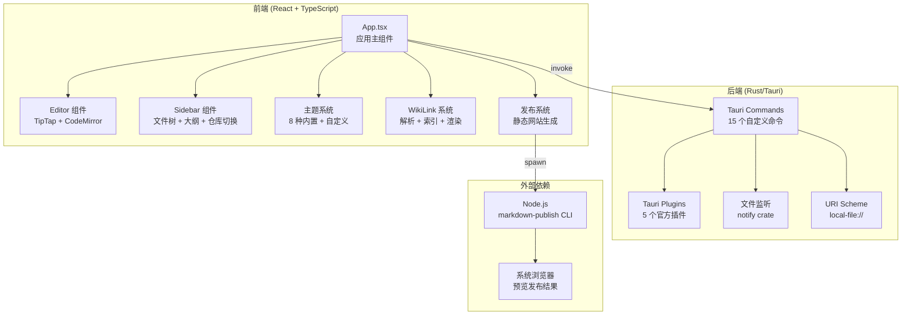

---

## 前端架构

### 组件层次结构

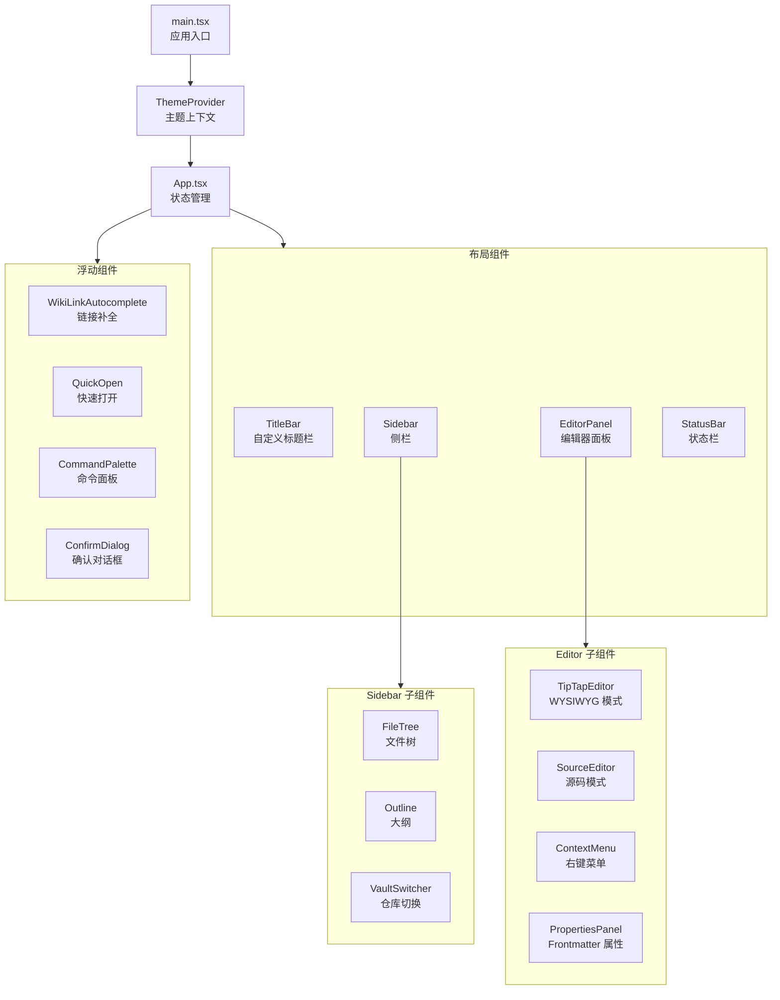

### 状态管理

App.tsx 是应用的状态中心，管理以下核心状态：

| 状态 | 类型 | 持久化 | 说明 |
|------|------|--------|------|
| `content` | string | 否 | 编辑器内容 |
| `fileName` | string | 否 | 当前文件路径 |
| `modified` | boolean | 否 | 修改状态 |
| `viewMode` | "ir" \| "sv" | localStorage | 编辑模式 |
| `vaults` | VaultInfo[] | localStorage | 仓库列表 |
| `activeVaultIndex` | number | localStorage | 当前仓库索引 |
| `sidebarOpen` | boolean | 否 | 侧栏开关 |
| `sidebarWidth` | number | localStorage | 侧栏宽度 |

### 主题系统

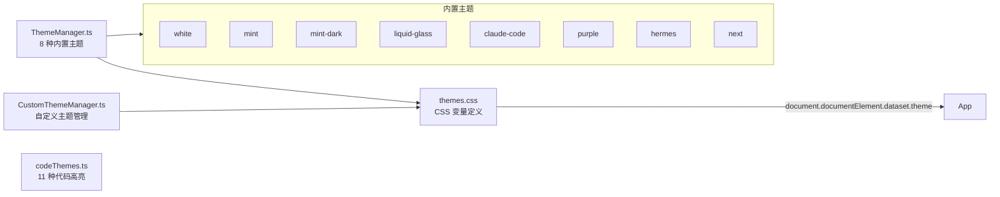

---

## 编辑器架构

### TipTap 编辑器

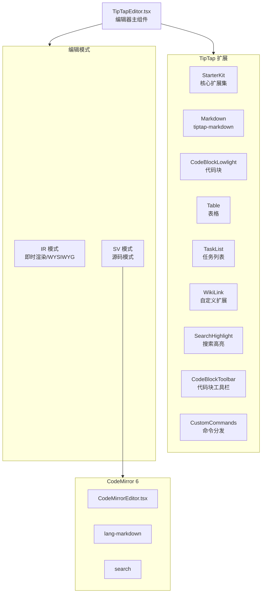

### 编辑器扩展列表

| 扩展 | 用途 |
|------|------|
| StarterKit | 核心扩展集合（已禁用部分以单独配置） |
| Bold/Italic/Strike/Code | 行内格式 |
| Blockquote/BulletList/OrderedList/ListItem | 块级格式 |
| CodeBlockLowlight | 代码块（带语法高亮） |
| Image | 图片（支持 inline、base64） |
| Link | 超链接 |
| Table/TableRow/TableCell/TableHeader | 表格 |
| TaskList/TaskItem | 任务列表 |
| Highlight | 高亮 |
| Typography | 排版优化 |
| Placeholder | 占位符文本 |
| Markdown (tiptap-markdown) | Markdown 序列化 |
| WikiLink | Obsidian 风格双向链接 |
| SearchHighlight | 搜索结果高亮 |
| CodeBlockToolbar | 代码块工具栏 |
| CustomCommands | 命令分发 |

### EditorHandle 接口

```typescript
interface EditorHandle {
  getValue: () => string;           // 获取 Markdown 内容
  setValue: (value: string) => void; // 设置内容
  insertTextAtCursor: (text: string) => void; // 在光标处插入文本
  replaceRangeWithWikiLink: (...) => void;     // 替换为 WikiLink
  resize: () => void;               // 调整大小
  highlightSearch: (query: string) => void;    // 高亮搜索
  clearHighlight: () => void;       // 清除高亮
  executeCommand: (name: string) => void;      // 执行命令
  scrollToHeading: (...) => void;   // 滚动到标题
  scrollToLine: (line: number) => void;        // 滚动到行
  getCursorOffset: () => number;    // 获取光标偏移
  isSourceMode: () => boolean;      // 是否源码模式
}
```

---

## WikiLink 系统

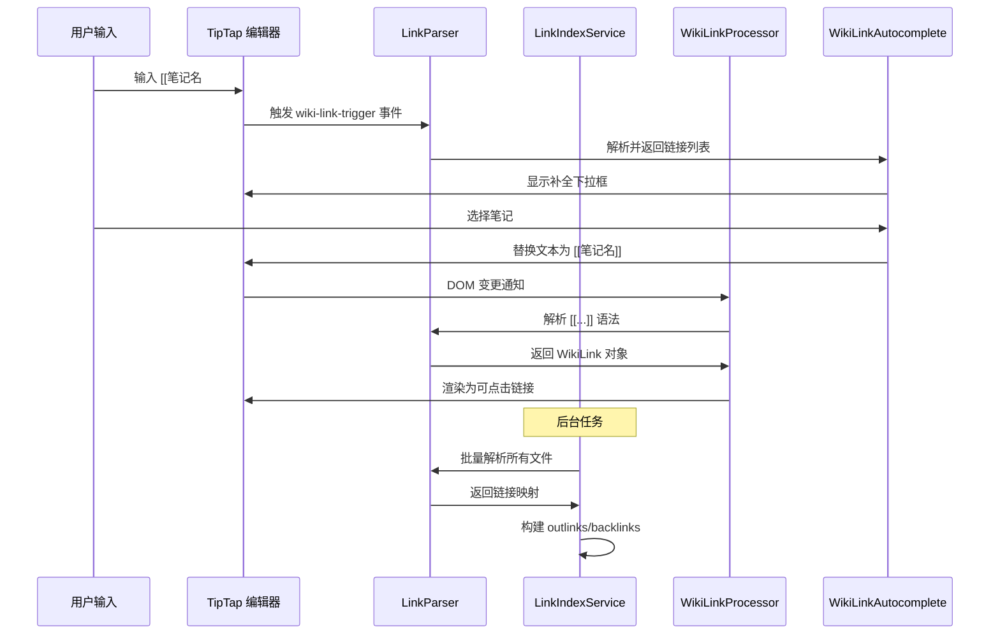

### 数据结构

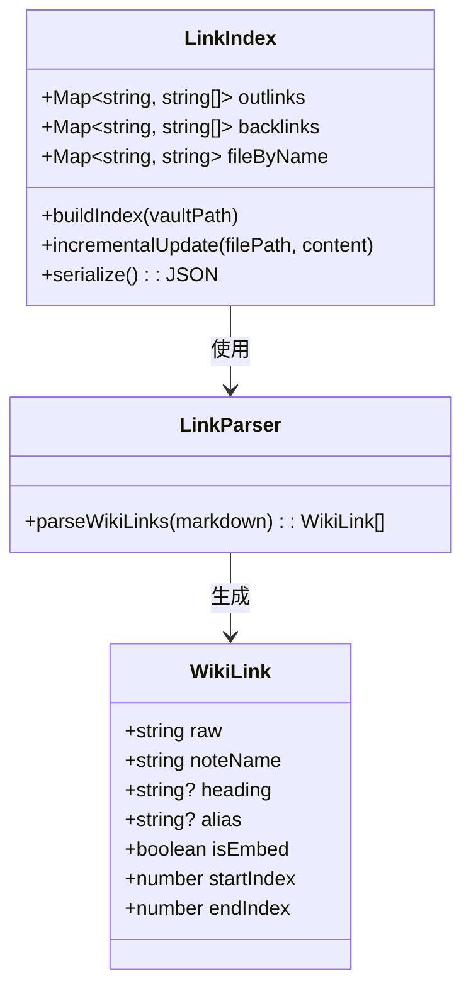

### 核心模块

| 模块 | 文件 | 职责 |
|------|------|------|
| 解析器 | `LinkParser.ts` | 正则匹配 `[[link]]` 和 `![[embed]]` 语法 |
| 索引服务 | `LinkIndexService.ts` | 维护 outlinks/backlinks 映射，支持全量/增量更新 |
| DOM 处理器 | `WikiLinkProcessor.ts` | 将文本节点中的 `[[...]]` 转换为可点击链接 |
| TipTap 扩展 | `extensions/wiki-link.ts` | 编辑器内的 WikiLink Node 扩展 |
| 自动补全 | `WikiLinkAutocomplete.tsx` | 监听事件显示补全列表 |
| 反向链接面板 | `BacklinksPanel.tsx` | 展示当前文件的反向链接和出链 |

---

## 后端架构

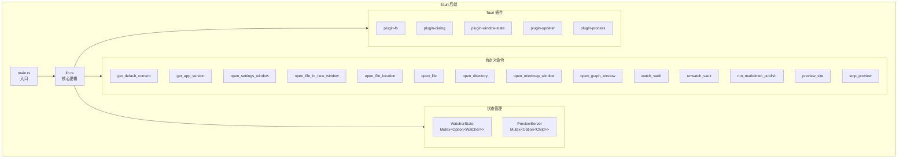

### 命令列表

| 命令 | 用途 | 参数 |
|------|------|------|
| `get_default_content` | 获取默认编辑器内容 | 无 |
| `get_app_version` | 获取应用版本号 | 无 |
| `get_cwd` | 获取当前工作目录 | 无 |
| `open_settings_window` | 打开设置窗口 | 无 |
| `open_file_in_new_window` | 在新窗口打开文件 | file_path, width?, height? |
| `open_file_location` | 在系统文件管理器中定位文件 | file_path |
| `open_file` | 用系统默认应用打开文件 | file_path |
| `open_directory` | 在系统文件管理器中打开目录 | dir_path |
| `open_mindmap_window` | 打开思维导图窗口 | 无 |
| `open_graph_window` | 打开知识图谱窗口 | 无 |
| `watch_vault` | 启动仓库文件系统监听 | path |
| `unwatch_vault` | 停止仓库文件系统监听 | 无 |
| `run_markdown_publish` | 调用 CLI 发布网站 | vault_dir, out_dir, config |
| `preview_site` | 启动 HTTP 服务器预览 | dir |
| `stop_preview` | 停止预览 HTTP 服务器 | 无 |

### 文件监听机制

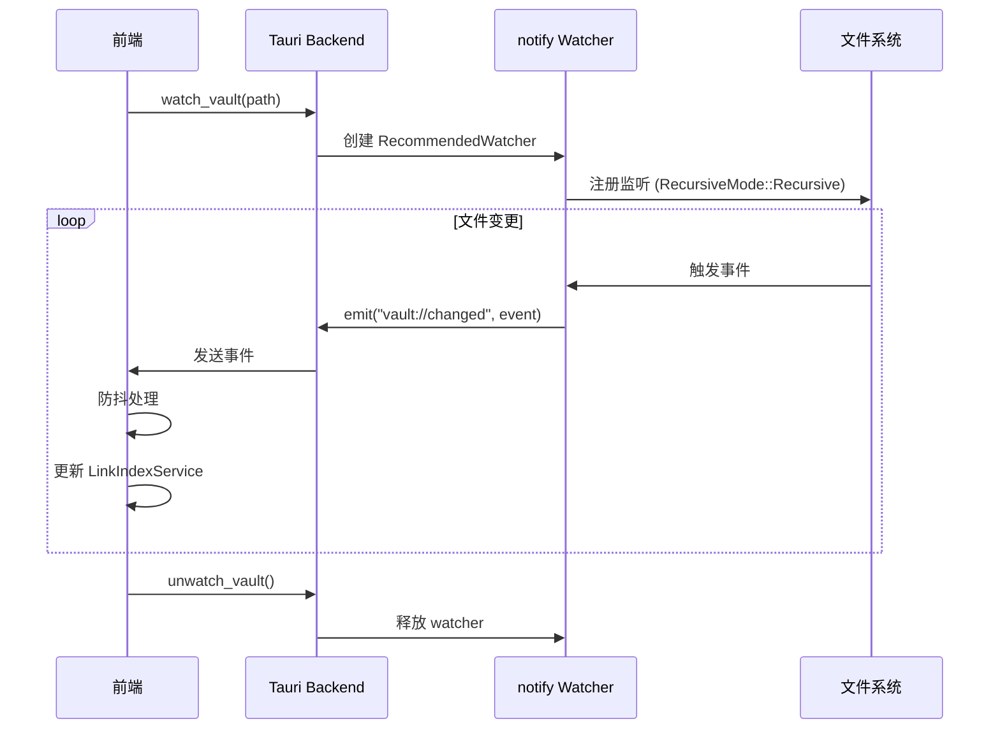

---

## 多窗口架构

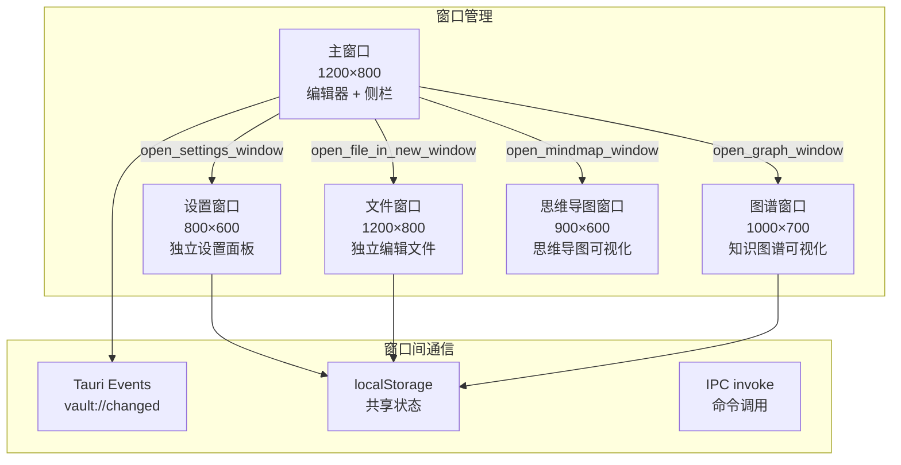

### 窗口类型

| 窗口 | 触发方式 | 默认大小 | 说明 |
|------|----------|----------|------|
| 主窗口 | 应用启动 | 1200×800 | 编辑器、侧栏等核心 UI |
| 设置窗口 | `open_settings_window` | 800×600 | 独立设置面板 |
| 文件窗口 | `open_file_in_new_window` | 1200×800 | 在独立窗口中编辑文件 |
| 图谱窗口 | `open_graph_window` | 1000×700 | 知识图谱可视化 |
| 思维导图窗口 | `open_mindmap_window` | 900×600 | 思维导图可视化 |

---

## 数据流

### 文件读写流程

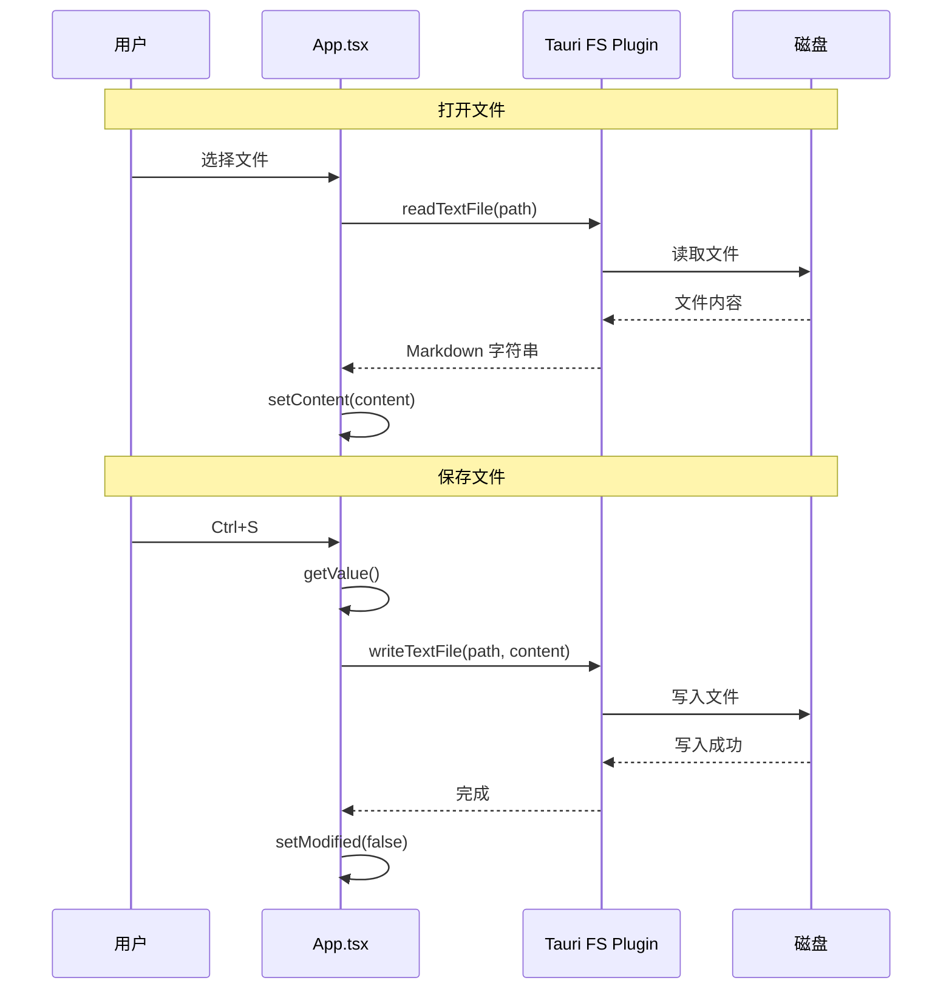

### 状态持久化

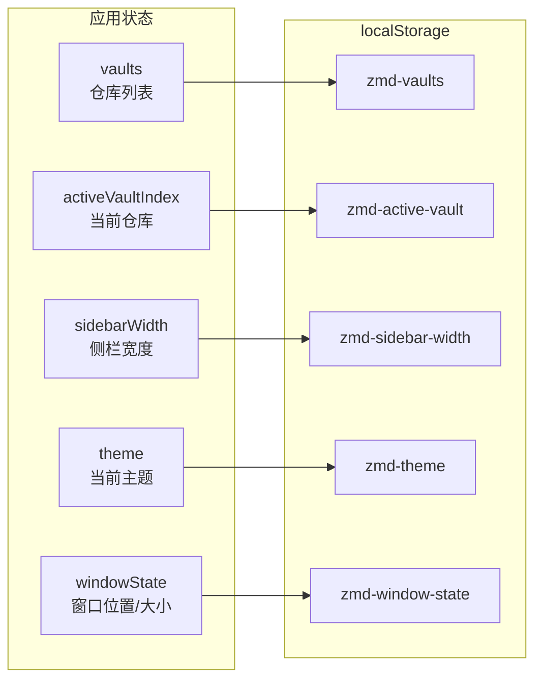

### 窗口状态恢复

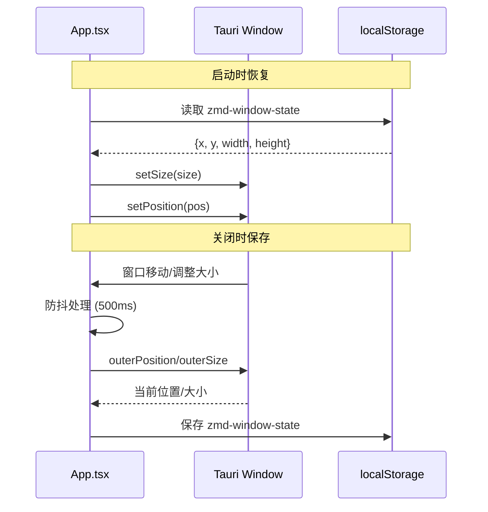

---

## CI/CD

### GitHub Actions 工作流

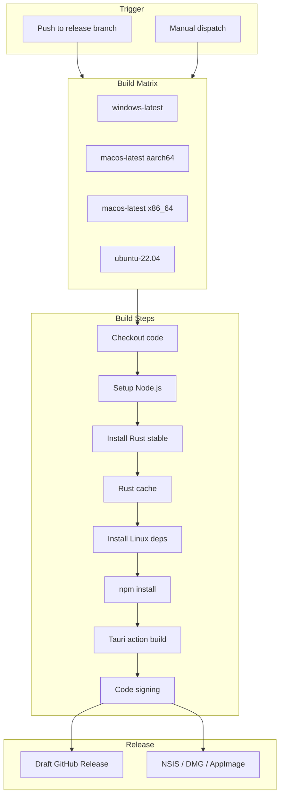

### Release 工作流

| 步骤 | 说明 |
|------|------|
| 1. Checkout | 拉取代码 |
| 2. Setup Node.js | 安装 LTS 版本 Node.js |
| 3. Install Rust | 安装 Rust stable 工具链 |
| 4. Rust Cache | 缓存 Rust 构建产物 |
| 5. Linux Dependencies | 安装 Linux 依赖 (webkit2gtk 等) |
| 6. npm install | 安装前端依赖 |
| 7. Tauri Action | 构建应用并签名 |
| 8. Release | 创建 Draft Release |

### 文档部署

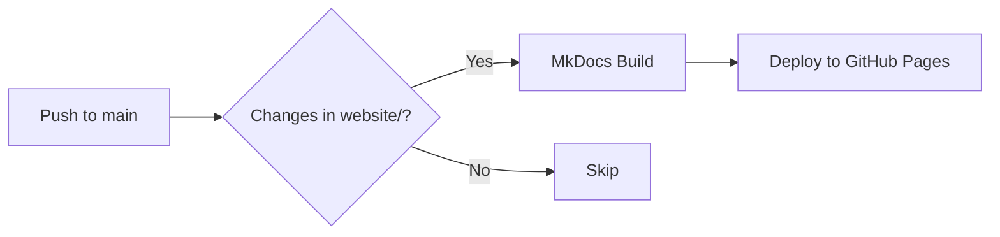

---

## 开发指南

### 环境搭建

```bash
# 1. 克隆仓库
git clone https://github.com/zuorn/Tydora.git
cd Tydora

# 2. 安装依赖
npm install

# 3. 启动开发服务器
npm run dev

# 4. 启动 Tauri 应用
npm run tauri
```

### 常用命令

| 命令 | 说明 |
|------|------|
| `npm run dev` | 启动 Vite 开发服务器 (端口 1420) |
| `npm run build` | 构建前端 (TypeScript + Vite) |
| `npm run preview` | 预览生产构建 |
| `npm run tauri` | 启动 Tauri 桌面应用 |
| `npm run docs:build` | 构建 MkDocs 文档站点 |
| `npm run docs:serve` | 本地预览文档站点 |

### 项目结构

```
Tydora/
├── src/                          # 前端源码
│   ├── App.tsx                   # 应用主组件
│   ├── main.tsx                  # 入口
│   ├── themes.tsx                # 主题 Context
│   ├── ThemeManager.ts           # 内置主题定义
│   ├── Sidebar.tsx               # 侧栏组件
│   ├── Editor/                   # 编辑器模块
│   │   ├── TipTapEditor.tsx      # TipTap 编辑器
│   │   ├── SourceEditor.tsx      # CodeMirror 编辑器
│   │   ├── extensions/           # 自定义扩展
│   │   └── types.ts              # 类型定义
│   ├── LinkIndexService.ts       # 链接索引服务
│   ├── LinkParser.ts             # WikiLink 解析器
│   └── ...                       # 其他模块
├── src-tauri/                    # Rust 后端
│   ├── src/
│   │   ├── main.rs               # 入口
│   │   ├── lib.rs                # 核心逻辑
│   │   └── commands/             # 自定义命令
│   ├── Cargo.toml                # Rust 依赖
│   └── tauri.conf.json           # Tauri 配置
├── docs/                         # 技术文档
├── website/                      # MkDocs 文档站点
├── .github/workflows/            # CI/CD 配置
└── package.json                  # 前端依赖
```

### TypeScript 配置

```json
{
  "compilerOptions": {
    "target": "ES2020",
    "module": "ESNext",
    "moduleResolution": "bundler",
    "strict": true,
    "noUnusedLocals": true,
    "noUnusedParameters": true,
    "jsx": "react-jsx",
    "paths": {
      "@/*": ["src/*"]
    }
  }
}
```

---

## 已知问题与经验教训

### 1. Tiptap v3 + React 19 兼容性问题

**问题**：`@tiptap/extensions` v3.27.1 的 Focus 扩展在 React 19 渲染时序下，`this.editor` 可能为 undefined。

**解决方案**：使用 `immediatelyRender: false` 让编辑器在 `useEffect` 中创建。

### 2. Vite 预构建缓存

**问题**：直接修改 `node_modules` 中的文件不会被 Vite 加载。

**解决方案**：使用 `patch-package` 或 Vite `resolve.alias`。

### 3. ProseMirror 插件内部错误

**问题**：错误发生在 ProseMirror 的 `Plugin.apply` 调用链中，上层 try-catch 无法拦截。

**解决方案**：在插件层面修复，不能依赖上层防御性代码。

---

## 附录

### CSS 文件清单

| 文件 | 用途 |
|------|------|
| `src/themes.css` | CSS 变量定义 8 种主题 |
| `src/App.css` | 主布局样式 |
| `src/Sidebar.css` | 侧栏/文件树/右键菜单 |
| `src/Editor/theme.css` | TipTap 编辑器样式 |
| `src/Settings.css` | 设置面板样式 |
| `src/PublishPanel.css` | 发布面板样式 |
| `src/GraphView.css` | 知识图谱样式 |
| `src/MindmapView.css` | 思维导图样式 |
| `src/WikiLink.css` | WikiLink 样式 |
| `src/BacklinksPanel.css` | 反向链接面板样式 |
| `src/FilePreview.css` | 文件预览样式 |

### 有用的链接

- [Tauri v2 文档](https://tauri.app/v2/)
- [TipTap 文档](https://tiptap.dev/)
- [CodeMirror 文档](https://codemirror.net/)
- [React 19 文档](https://react.dev/)
