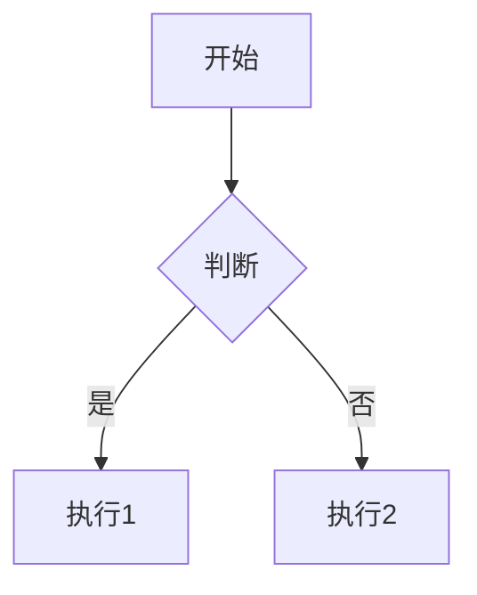

# Markdown 语法支持

Tydora 基于 Vditor 引擎，支持完整的 CommonMark 和 GFM 语法，以及多种扩展语法。

## 基础语法

### 标题

```markdown
# 一级标题
## 二级标题
### 三级标题
#### 四级标题
##### 五级标题
###### 六级标题
```

### 文本格式

```markdown
**加粗**
*斜体*
~~删除线~~
`行内代码`
```

### 列表

```markdown
- 无序列表项
- 另一项

1. 有序列表项
2. 另一项

- [ ] 任务列表项（未完成）
- [x] 任务列表项（已完成）
```

### 链接与图片

```markdown
[链接文本](https://example.com)

```

### 引用

```markdown
> 这是引用块
> 支持多行
```

### 代码块

````markdown
```语言名称
代码内容
```
````

## GFM 扩展

### 表格

```markdown
| 列1 | 列2 | 列3 |
|-----|-----|-----|
| 内容 | 内容 | 内容 |
```

### 自动链接

```
https://example.com 会自动转换为链接
```

## 扩展语法

### 脚注

```markdown
正文内容[^1]

[^1]: 这是脚注内容
```

### 目录

```markdown
[toc]
```

### 高亮

```markdown
==高亮文本==
```

### 上下标

```markdown
上标：X^2
下标：H~2~O
```

### YAML Front Matter

```yaml
---
title: 文档标题
tags: [标签1, 标签2]
---
```

## 数学公式

支持 KaTeX 和 MathJax 引擎渲染数学公式。

```markdown
行内公式：$E=mc^2$

块级公式：
$$
\sum_{i=1}^{n} i = \frac{n(n+1)}{2}
$
```

> 详见 [[数学公式]]

## Mermaid 图表

支持 Mermaid 语法绘制流程图、时序图等。

```markdown

```

## 相关文档

- [[数学公式]] — 公式详解
- [[代码块]] — 代码高亮
- [[表格操作]] — 表格编辑
- [[Wiki链接]] — Wiki 链接语法
