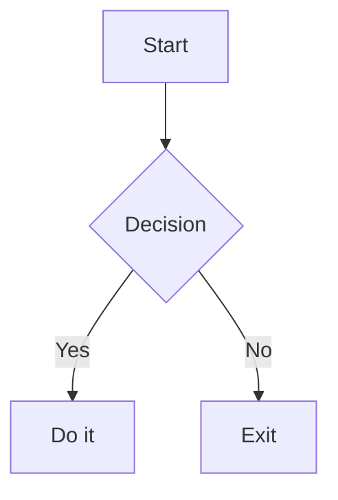

# Markdown Syntax Support

Tydora is built on TipTap 3.x + CodeMirror 6 and supports the complete CommonMark and GitHub Flavored Markdown (GFM) syntax, extended with WikiLinks, tags, callouts, math, Mermaid, and more. This page summarizes the syntax you'll use most.

> [!NOTE] The examples below can be typed directly in live preview mode (they render as you type), or written as plain text in source mode. The differences between the modes are covered in [[02-Editor/01-Editing-Modes]].

## Basic Syntax

### Headings

```markdown
# Heading 1
## Heading 2
### Heading 3
#### Heading 4
##### Heading 5
###### Heading 6
```

> Shortcut for heading levels: `Ctrl+1` through `Ctrl+6`, and `Ctrl+0` to reset to a normal paragraph. See [[07-Settings/04-Shortcut-Reference]].

### Text Formatting

```markdown
**bold**
*italic*
~~strikethrough~~
`inline code`
==highlighted text==
```

> `==highlight==` takes effect in live preview the moment you type the closing `==`. The shortcut is `Ctrl+=`.

### Lists

```markdown
- An unordered item
- Another item

1. An ordered item
2. Another item

- [ ] An open task
- [x] A completed task
```

> Task list checkboxes can be toggled by clicking; `Ctrl+Shift+J` also toggles completion.

### Links and Images

```markdown
[Link text](https://example.com)
[A relative path link](notes/another-note.md)

```

> Typing a bare URL (such as `https://example.com`) is recognized as a link automatically; `[text](path)` converts to a link the moment you close the bracket.

### Blockquotes

```markdown
> This is a blockquote
> It supports multiple lines
```

### Code Blocks

Wrap code in three backticks and annotate the language to get highlighting:

````markdown
```javascript
function hello() {
  console.log("Hello, Tydora!");
}
```
````

> See [[02-Editor/03-Code-Blocks]].

## GFM Extensions

### Tables

```markdown
| Col 1 | Col 2 | Col 3 |
|-------|-------|-------|
| cell  | cell  | cell  |
```

> Tables can also be created and edited in live preview with the floating toolbar. See [[02-Editor/08-Table-Operations]].

### Task Lists

See the `- [ ]` / `- [x]` syntax under "Lists" above.

### Autolinks

Typing a bare URL is recognized as a link automatically:

```
https://example.com
```

## Extended Syntax

### Callout Blocks

GitHub-style callouts — 15 types in total — declared with a blockquote plus `[!TYPE]`:

```markdown
> [!NOTE]
> A general note

> [!TIP]
> A small tip

> [!WARNING]
> A warning
```

Supported types: `NOTE`, `TIP`, `IMPORTANT`, `WARNING`, `CAUTION`, `ABSTRACT`, `INFO`, `SUCCESS`, `QUESTION`, `FAILURE`, `DANGER`, `BUG`, `EXAMPLE`, `QUOTE`, `FAQ`.

> For the full type list and collapse control, see [[02-Editor/06-Callout-Blocks]].

### Tags

Typing `#tagname` directly in the body creates a tag node. It joins the tag index and can be browsed and filtered from the sidebar "Tags" tab:

```markdown
Read a chapter of #reading today, and jotted down a few points on #methodology.
```

> Tags can also be declared in the Frontmatter `tags` field. See [[03-Knowledge-Management/06-Tags]].

### YAML Frontmatter

A `---` block at the very start of a file defines metadata:

```yaml
---
title: Document title
tags: [tag1, tag2]
date: 2024-01-01
---
```

> See [[02-Editor/07-Frontmatter]].

## Knowledge Management Syntax

### Wiki Links

```markdown
[[Note Name]]
[[Note Name|Display Alias]]
[[Note Name#Heading]]
[[Folder/Note Name]]
[[Note Name.canvas]]
```

> See [[03-Knowledge-Management/01-Wiki-Links]].

### Embedded Content

```markdown
![[Note Name]]
![[Note Name#Heading]]
```

> Embedding supports images and canvas files. See [[03-Knowledge-Management/02-Embedded-Content]].

## Math

Rendered with KaTeX, in both inline and block positions:

```markdown
Inline: $E=mc^2$

Block:
$$
\sum_{i=1}^{n} i = \frac{n(n+1)}{2}
$$
```

> See [[02-Editor/04-Math-Formulas]].

## Mermaid Diagrams

````markdown

````

> See [[02-Editor/05-Mermaid-Diagrams]].

## Syntax Without Special Rendering

The following syntax is treated as **plain text** in Tydora and does not render as a special element. If you are migrating from another editor, take note:

| Syntax | Notes |
| --- | --- |
| `[^1]` footnotes | Not rendered as a footnote section — shown as text only (the right-click "Insert Footnote" command inserts a `[^1]: ` text placeholder) |
| `[toc]` table of contents | No automatic TOC; use the sidebar "Outline" tab instead — see [[05-Navigation-Search/03-Outline-Panel]] |
| `X^2^` / `H~2~O` superscript/subscript | Not rendered; for math use formula syntax `$X^2$` / `$H_2O$` |
| `[[Note Name^block-id]]` block references | Block-level references are not supported; use `[[Note Name#Heading]]` instead |

## Related Documents

- [[02-Editor/04-Math-Formulas]] — Math in detail
- [[02-Editor/03-Code-Blocks]] — Code highlighting
- [[02-Editor/08-Table-Operations]] — Table editing
- [[02-Editor/06-Callout-Blocks]] — Callout types
- [[02-Editor/07-Frontmatter]] — Metadata
- [[03-Knowledge-Management/01-Wiki-Links]] — Bidirectional link syntax
- [[03-Knowledge-Management/06-Tags]] — The tag system
