# Mermaid Diagrams

Tydora integrates the Mermaid diagram engine, so you can draw flowcharts, sequence diagrams, Gantt charts, class diagrams, state diagrams, and more directly in Markdown as text, with live rendering.

> [!NOTE] Write them in a `mermaid` code block. Diagram rendering is on by default; there is no separate toggle.

## Basic Syntax

Use `mermaid` as the code block language:

````markdown
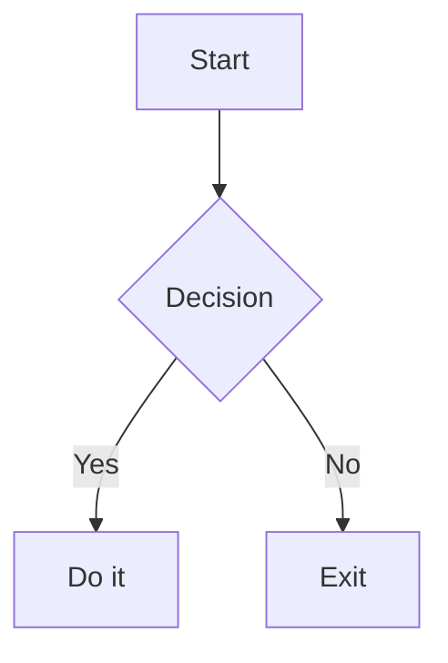
````

> [!TIP] Diagram themes follow the app theme; the diagram itself is not directly draggable/editable — go back to the code block to make changes.

## Mermaid Examples

Below are minimal examples of the main diagram types. Copy them into a note to see the results.

### Flowchart

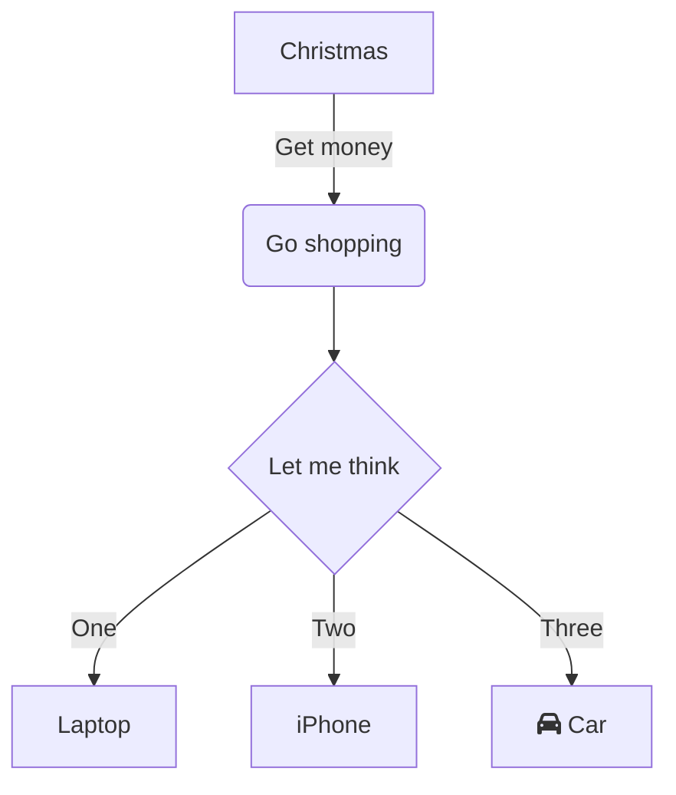

### Class Diagram

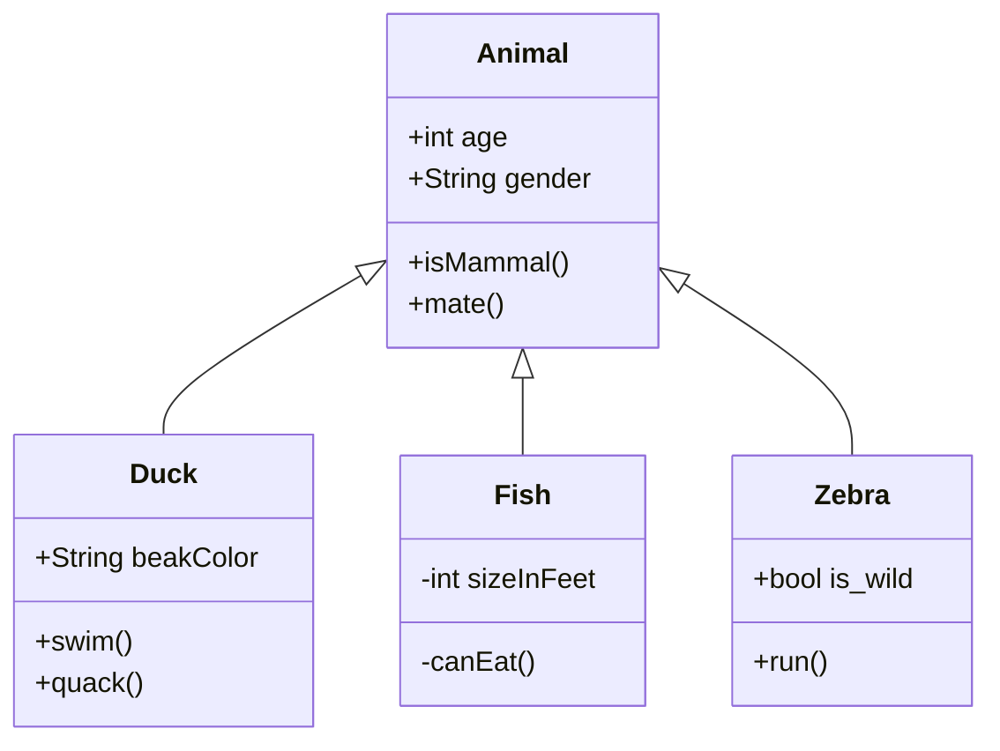

### State Diagram

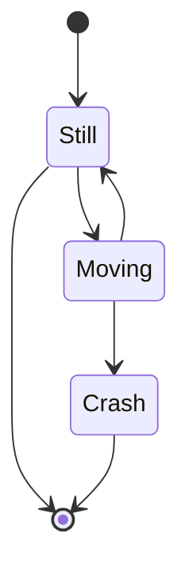

### ER Diagram

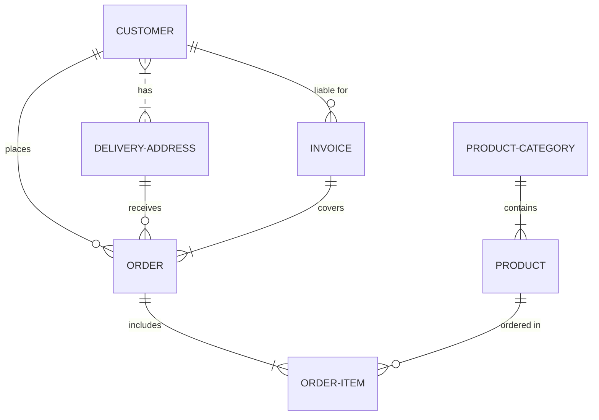

### XY Chart

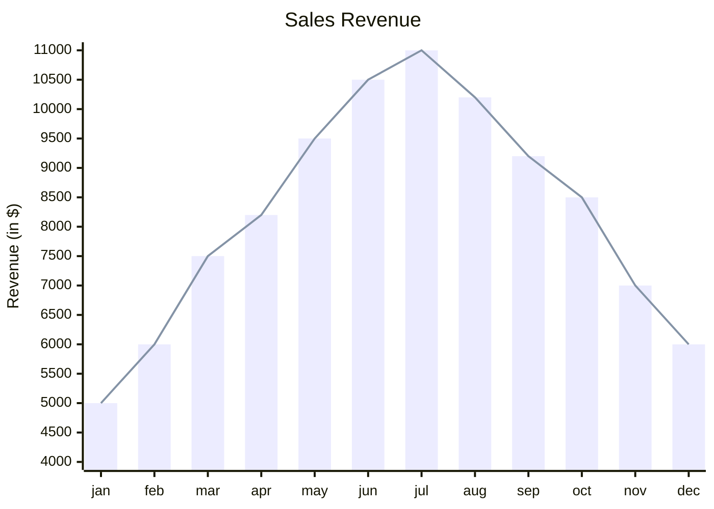

### User Journey

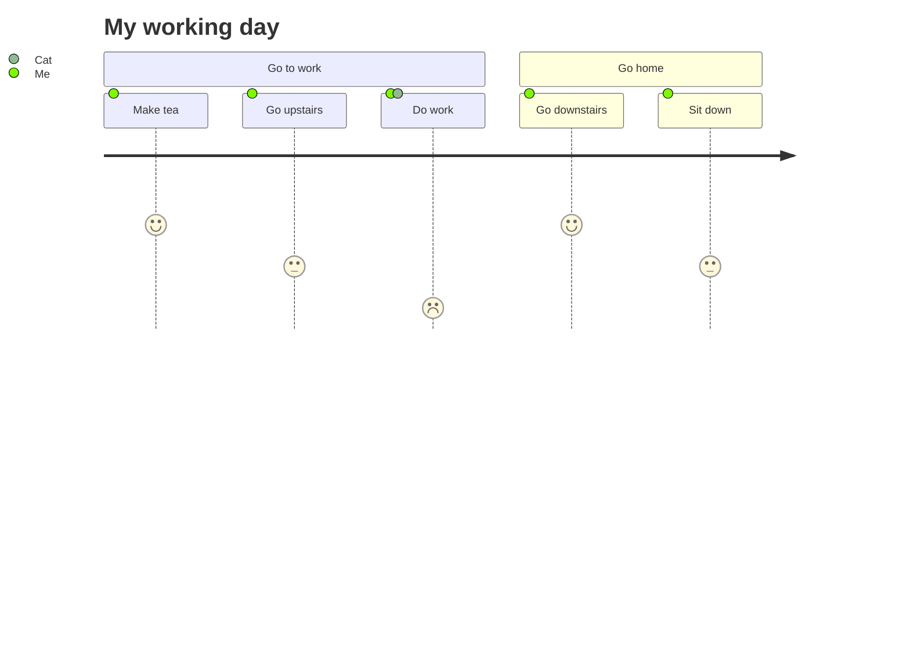

### Gantt Chart

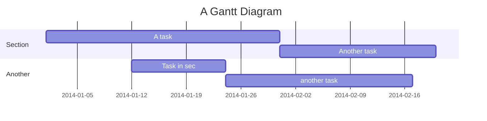

### Pie Chart

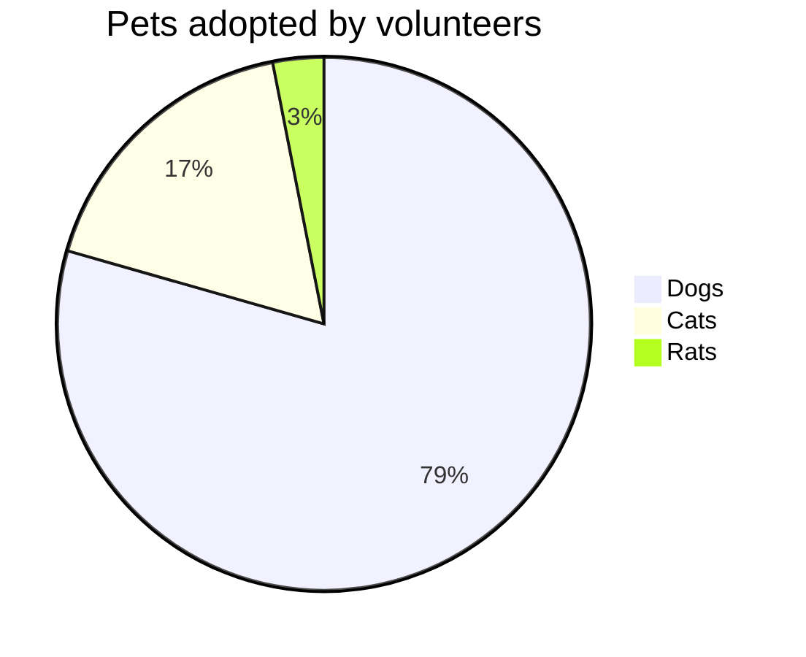

### Quadrant Chart

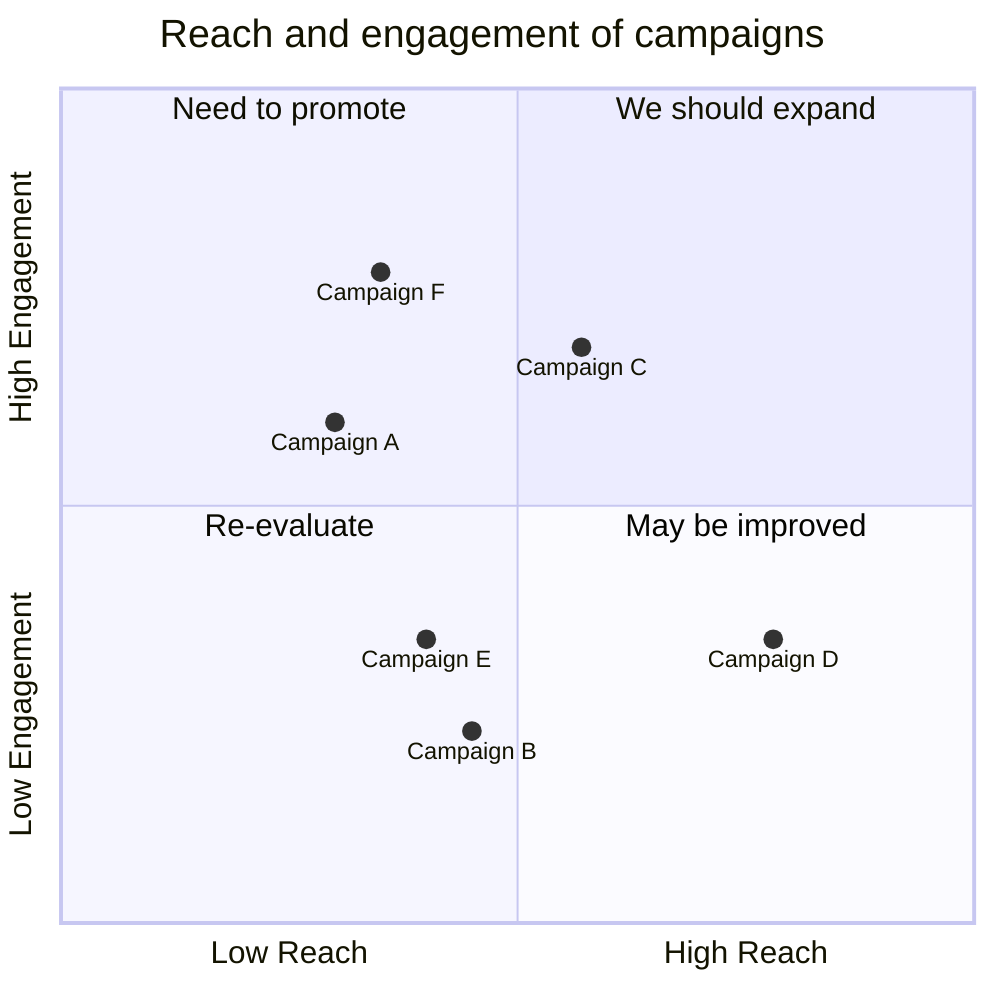

### Mind Map

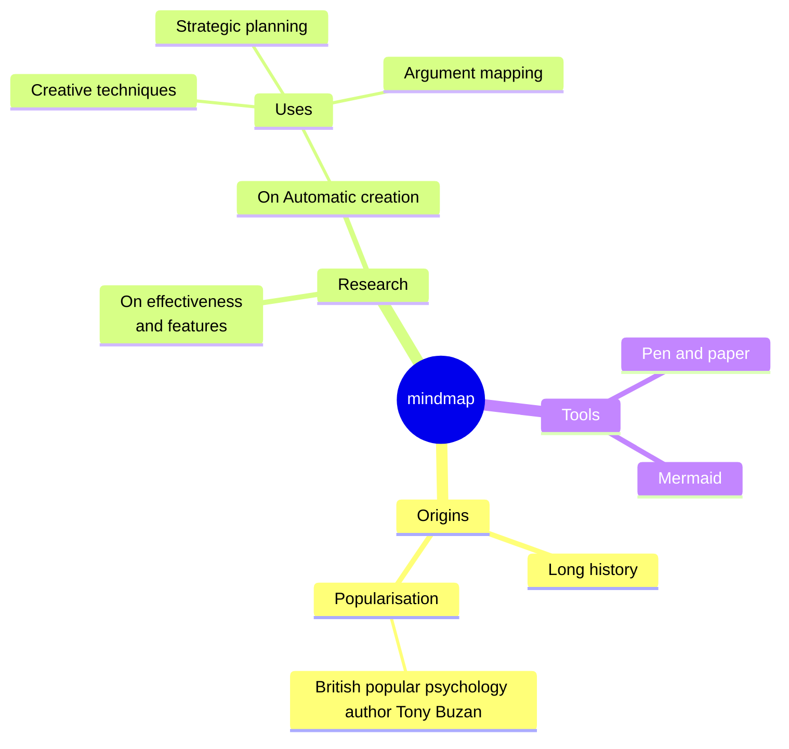

> [!TIP]
> This is Mermaid's own mind map syntax, which is a different capability from Tydora's Markmap-based [[08-Advanced-Features/02-Mind-Map]]: the former requires you to write the structure by hand, the latter is generated automatically from heading levels.

### Git Graph

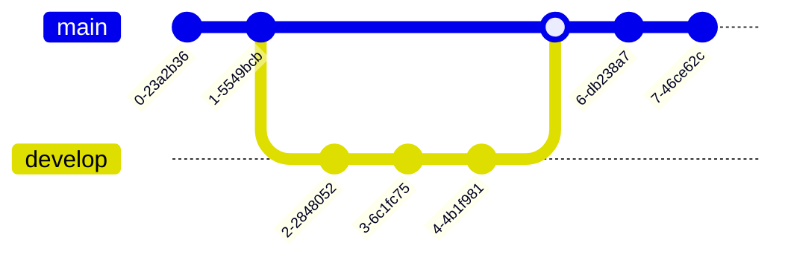

### Kanban

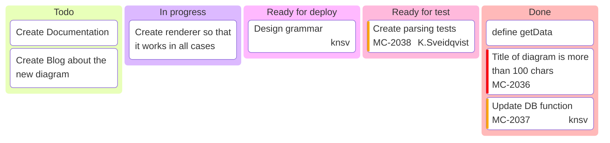

### Architecture Diagram

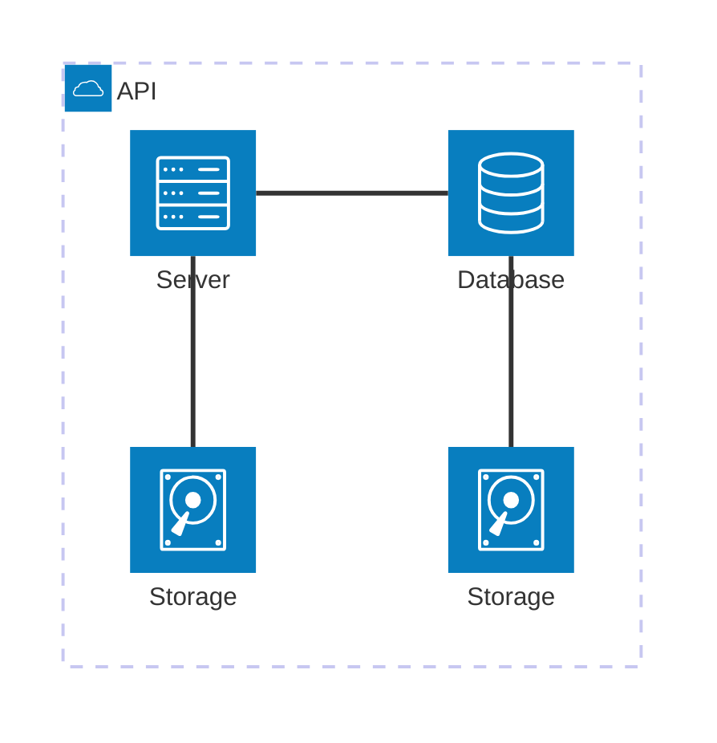

### Packet Diagram

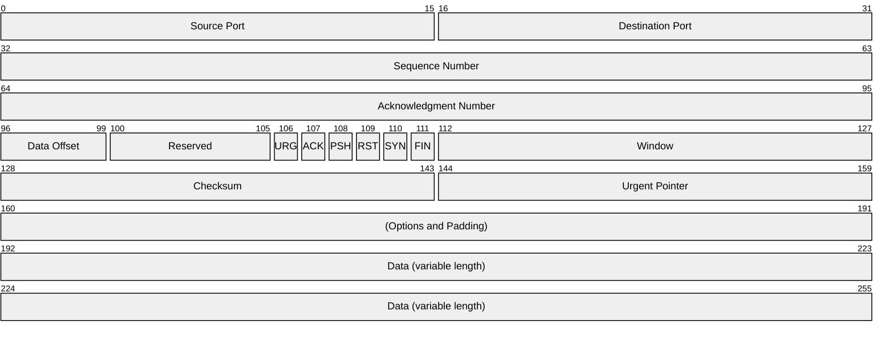

## Troubleshooting

- The code block language must be exactly `mermaid`; variants like `mermaidjs` are not recognized
- The syntax is sensitive to indentation and arrow symbols — writing `->` instead of `-->` will error
- If node text contains `(`, `)`, `[`, `]`, wrap it in quotes, e.g. `A["text (with parens)"]`
- For more syntax, see the [official Mermaid documentation](https://mermaid.js.org/)

## Related Documents

- [[02-Editor/02-Markdown-Syntax]] — Syntax in detail
- [[02-Editor/03-Code-Blocks]] — Using code blocks
- [[08-Advanced-Features/02-Mind-Map]] — Mind maps generated from headings
