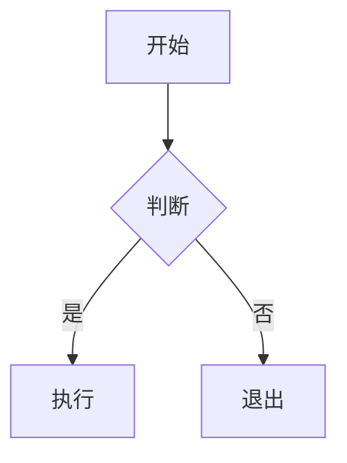

# Markdown 语法支持

Tydora 基于 TipTap 3.x + CodeMirror 6 引擎，支持完整的 CommonMark 与 GitHub 风格（GFM）语法，并扩展了 WikiLink、标签、Callout、数学公式、Mermaid 等能力。本页汇总写作时最常用的语法。

> [!NOTE]以下示例既可在即时渲染模式下直接输入（会自动渲染），也可在源码模式下以纯文本编写。两种模式的差异见 [[02-编辑器/01-编辑模式]]。

## 基础语法

### 标题

```markdown
# 一级标题
## 二级标题
### 三级标题
#### 四级标题
##### 五级标题
###### 六级标题
```

> 快捷设置标题级别：`Ctrl+1` \~ `Ctrl+6`，`Ctrl+0` 恢复为正文段落。详见 [[07-设置/04-快捷键速查]]。

### 文本格式

```markdown
**加粗**
*斜体*
~~删除线~~
`行内代码`
==高亮文本==
```

> `==高亮==` 在即时渲染模式下输入结束的 `==` 时会立即生效。快捷键为 `Ctrl+=`。

### 列表

```markdown
- 无序列表项
- 另一项

1. 有序列表项
2. 另一项

- [ ] 未完成任务
- [x] 已完成任务
```

> 任务列表的复选框可直接点击切换；`Ctrl+Shift+J` 也可切换完成状态。

### 链接与图片

```markdown
[链接文本](https://example.com)
[相对路径链接](notes/另一篇笔记.md)

```

> 直接书写 URL（如 `https://example.com`）会被自动识别为链接；`[文本](路径)` 在输入闭合括号时会即时转换为链接。

### 引用

```markdown
> 这是引用块
> 支持多行内容
```

### 代码块

使用三个反引号包裹，并标注语言以获得高亮：

````markdown
```javascript
function hello() {
  console.log("Hello, Tydora!");
}
```
````

> 详见 [[02-编辑器/03-代码块]]。

## GFM 扩展

### 表格

```markdown
| 列1 | 列2 | 列3 |
|-----|-----|-----|
| 内容 | 内容 | 内容 |
```

> 表格的创建与编辑也可以在即时渲染下用浮动工具栏完成，详见 [[02-编辑器/08-表格操作]]。

### 任务列表

见上文「列表」中的 `- [ ]` / `- [x]` 语法。

### 自动链接

直接书写 URL 即可自动识别为链接：

```
https://example.com
```

## 扩展语法

### Callout 提示块

GitHub 风格的提示块，共 15 种类型，用引用块加 `[!TYPE]` 声明：

```markdown
> [!NOTE]
> 这是一个普通提示

> [!TIP]
> 这是一个小技巧

> [!WARNING]
> 这是一个警告
```

支持的类型：`NOTE`、`TIP`、`IMPORTANT`、`WARNING`、`CAUTION`、`ABSTRACT`、`INFO`、`SUCCESS`、`QUESTION`、`FAILURE`、`DANGER`、`BUG`、`EXAMPLE`、`QUOTE`、`FAQ`。

> 完整类型与折叠控制见 [[02-编辑器/06-Callout块]]。

### 标签

正文中直接写 `#标签名` 即可创建标签节点，它会参与标签索引，可在侧栏「标签」页签中查看与筛选：

```markdown
今天读了 #读书 里的一章，记几个 #方法论 的要点。
```

> 标签也可以在 Frontmatter 的 `tags` 字段中声明。详见 [[03-知识管理/06-标签]]。

### YAML Frontmatter

文件开头的 `---` 块用于定义元数据：

```yaml
---
title: 文档标题
tags: [标签1, 标签2]
date: 2024-01-01
---
```

> 详见 [[02-编辑器/07-Frontmatter]]。

## 知识管理语法

### Wiki 链接

```markdown
[[笔记名]]
[[笔记名|显示别名]]
[[笔记名#标题]]
[[文件夹/笔记名]]
[[笔记名.canvas]]
```

> 详见 [[03-知识管理/01-Wiki链接]]。

### 嵌入内容

```markdown
![[笔记名]]
![[笔记名#标题]]
```

> 目前支持嵌入笔记正文与白板缩略图，图片 / 视频 / 音频请使用标准 Markdown 图片语法。详见 [[03-知识管理/02-嵌入内容]]。

## 数学公式

使用 KaTeX 渲染，支持行内与块级两种位置：

```markdown
行内公式：$E=mc^2$

块级公式：
$$
\sum_{i=1}^{n} i = \frac{n(n+1)}{2}
$$
```

> 详见 [[02-编辑器/04-数学公式]]。

## Mermaid 图表

````markdown

````

> 详见 [[02-编辑器/05-Mermaid图表]]。

## 暂无特殊渲染的语法

以下语法在 Tydora 中会被当作**普通文本**处理，不会渲染为特殊元素。若你从其他编辑器迁移过来，请注意：

| 语法 | 说明 |
| --- | --- |
| `[^1]` 脚注 | 不渲染为脚注区，仅作为文本显示（右键菜单的「插入脚注」会插入 `[^1]: ` 文本占位） |
| `[toc]` 目录 | 不自动生成目录，可用侧栏「大纲」页签代替，见 [[05-导航与搜索/03-大纲面板]] |
| `X^2^` / `H~2~O` 上标下标 | 不渲染；数学场景请改用公式语法 `$X^2$` / `$H_2O$` |
| `[[笔记名^块ID]]` 块引用 | 不支持块级引用；可改用 `[[笔记名#标题]]` |

## 相关文档

- [[02-编辑器/04-数学公式]] — 公式详解
- [[02-编辑器/03-代码块]] — 代码高亮
- [[02-编辑器/08-表格操作]] — 表格编辑
- [[02-编辑器/06-Callout块]] — 提示块类型
- [[02-编辑器/07-Frontmatter]] — 元数据
- [[03-知识管理/01-Wiki链接]] — 双向链接语法
- [[03-知识管理/06-标签]] — 标签体系
