# Mermaid 图表

Tydora 集成了 Mermaid 图表引擎，让你直接在 Markdown 中用文本绘制流程图、时序图、甘特图、类图、状态图等，并实时渲染预览。

> [!NOTE]使用 `mermaid` 代码块编写。图表渲染默认开启，没有单独的开关设置项。

## 基本语法

用 `mermaid` 作为代码块语言：

````markdown
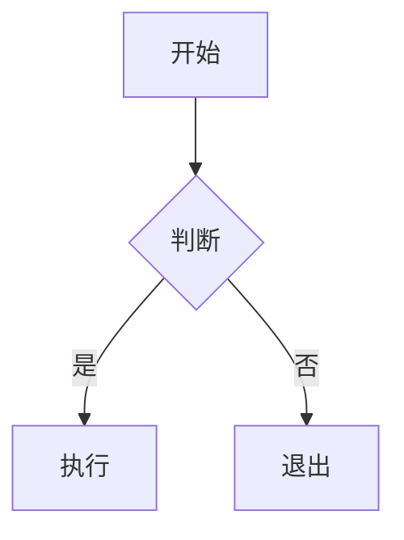
````

> [!TIP]图表主题跟随应用主题；图表本体不可直接拖拽编辑，修改请回到代码块。

## Mermaid 示例

下面列出各主要图表类型的最小示例，可直接复制到笔记中查看效果。

### 流程图

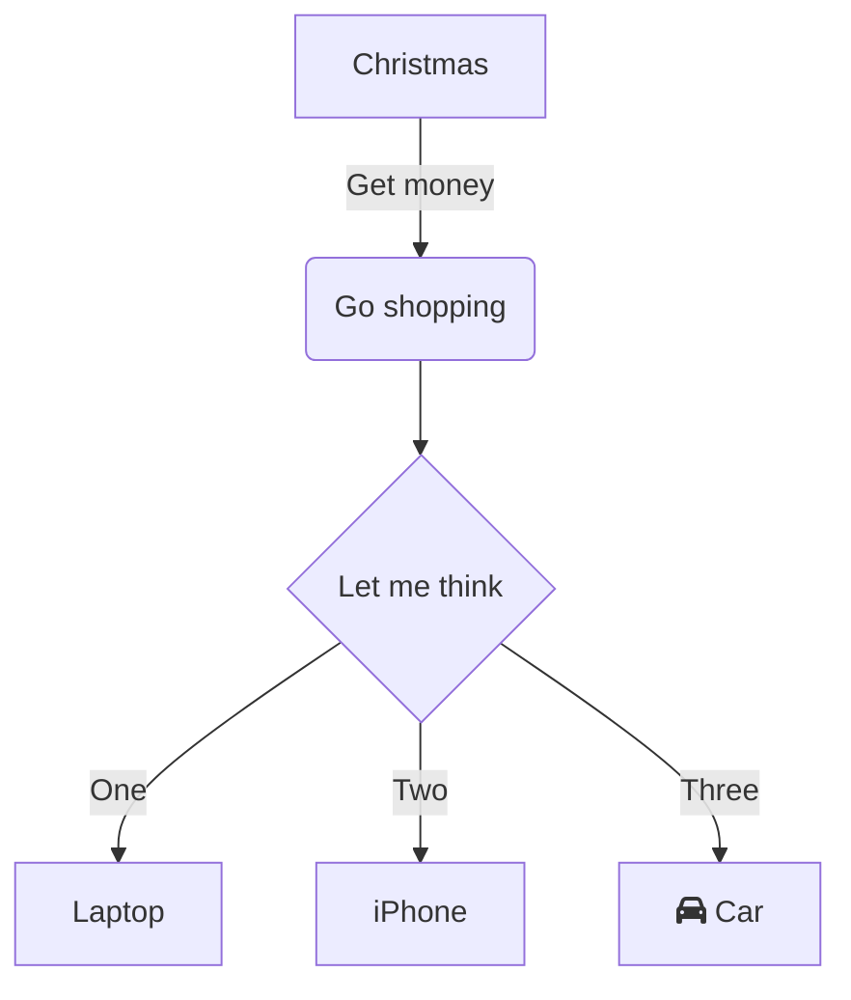

### 类图

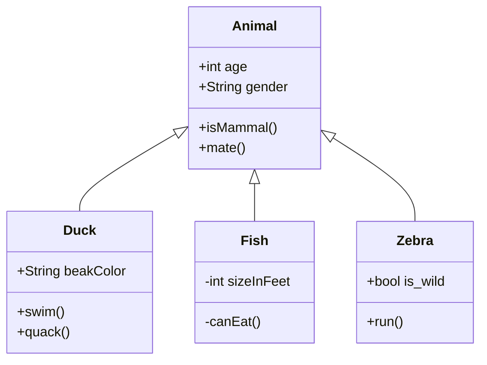

### 状态图

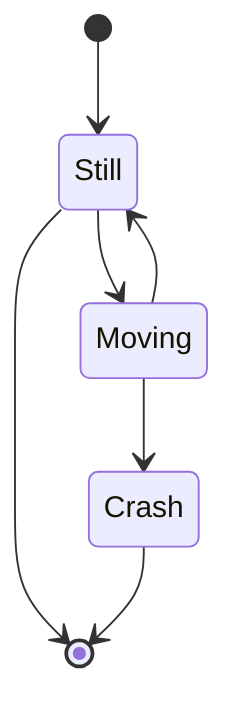

### ER 图

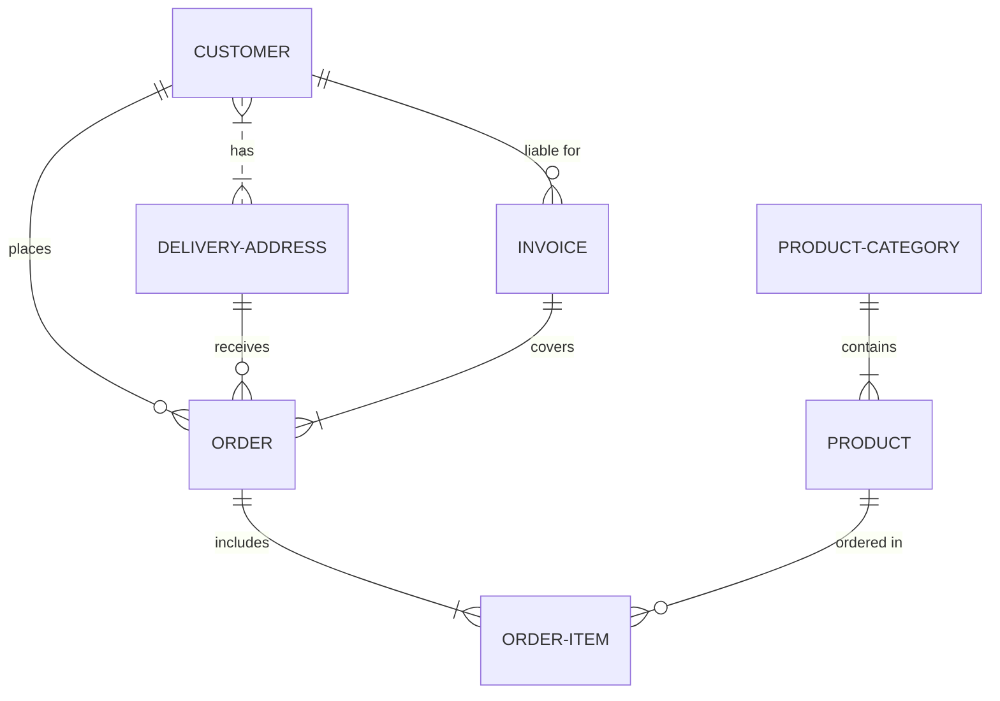

### XY 图

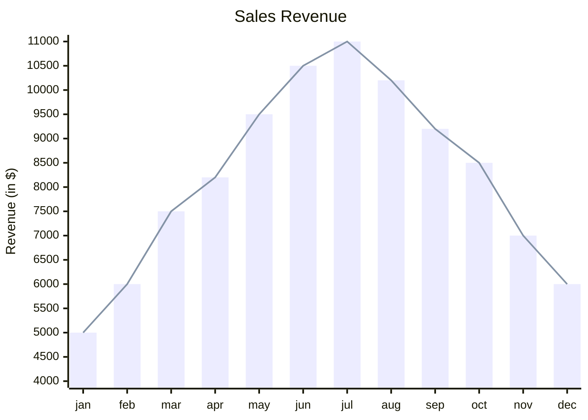

### 旅行图

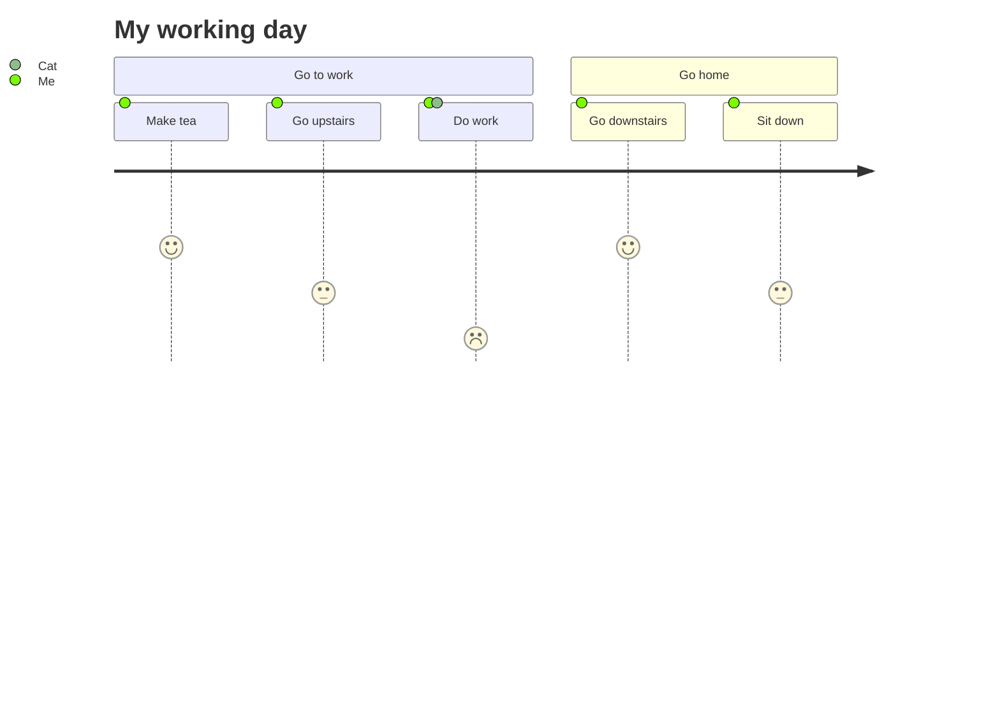

### 甘特图

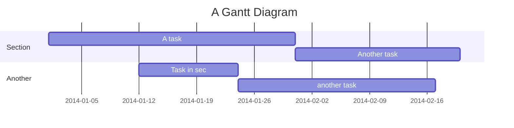

### 饼图

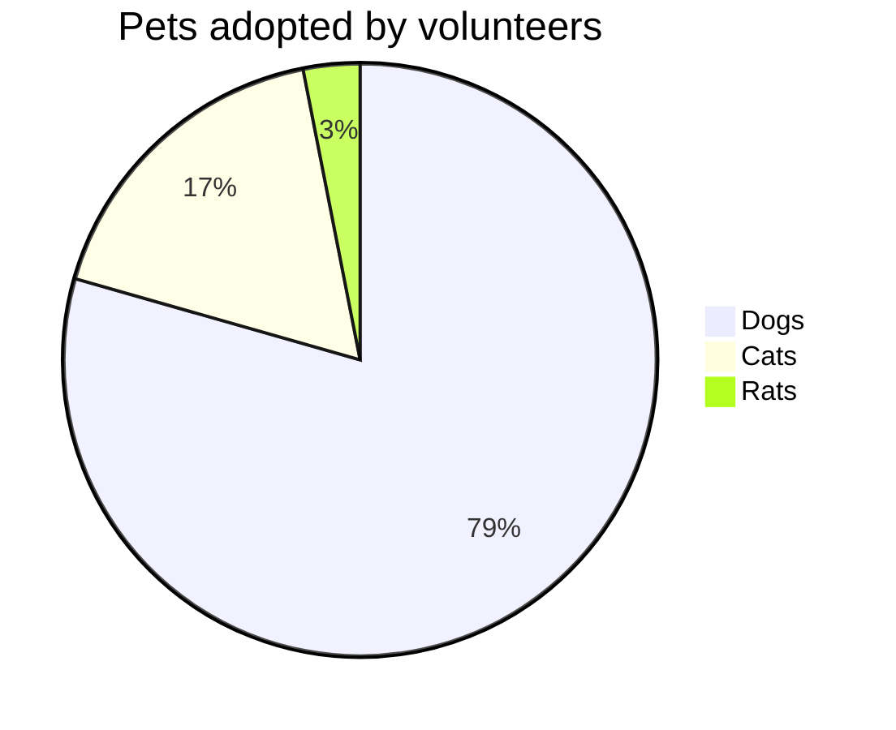

### 四象图


### 思维导图

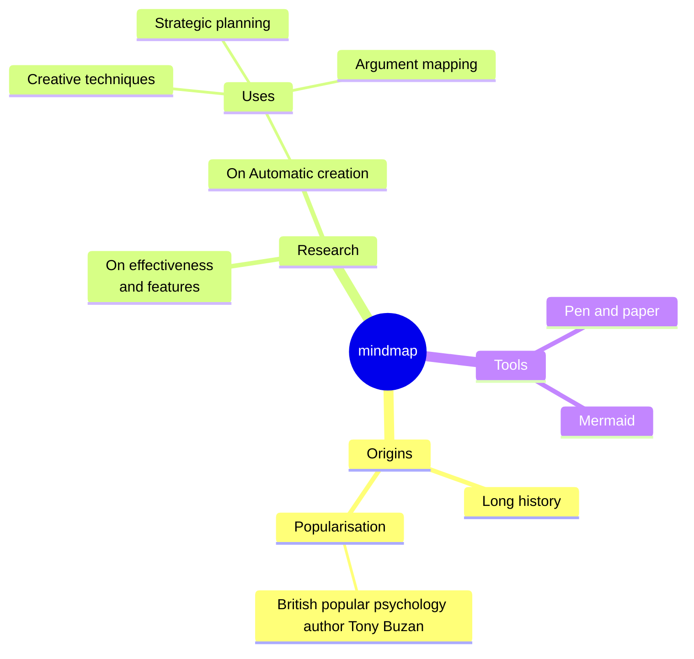

> [!TIP]
> 这是 Mermaid 自带的思维导图语法，与 Tydora 基于 Markmap 的 [[08-高级功能/02-思维导图]] 是两套不同的能力：前者需要手写结构，后者由标题层级自动生成。

### Git 图

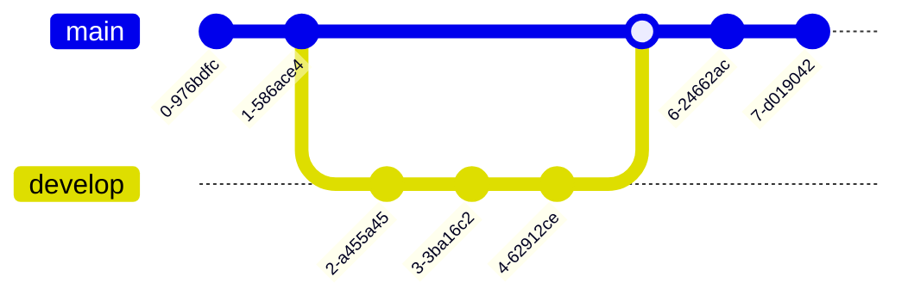

### 看板图

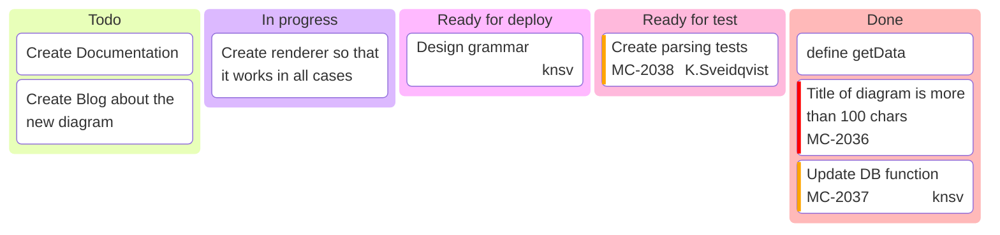

### 架构图

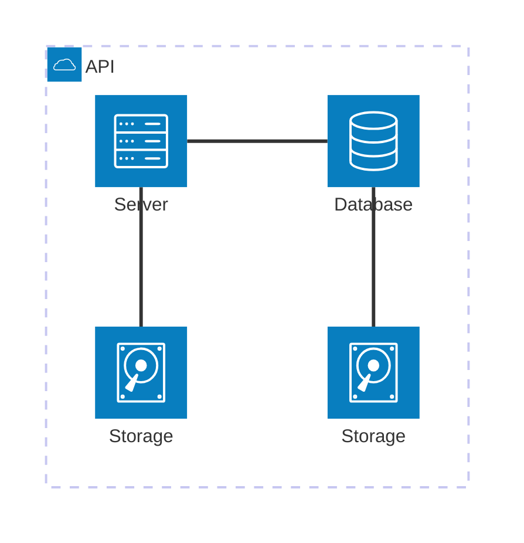

### 数据包图

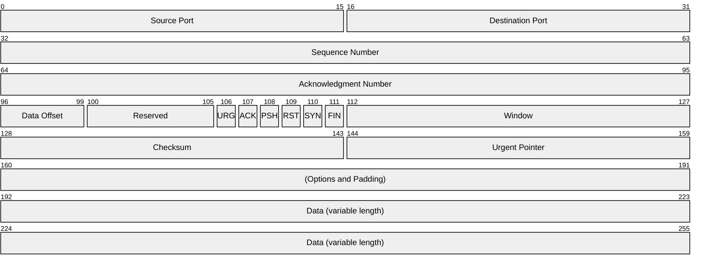

## 排错建议

- 代码块语言必须写作 `mermaid`，写成 `mermaidjs` 等不会被识别
- 图表语法对缩进与箭头符号敏感，`-->` 写成 `->` 会报错
- 节点文本里含 `(`、`)`、`[`、`]` 等符号时，用引号包裹，如 `A["含(括号)的文本"]`
- 更多语法请参考 [Mermaid 官方文档](https://mermaid.js.org/)

## 相关文档

- [[02-编辑器/02-Markdown语法]] — 语法详解
- [[02-编辑器/03-代码块]] — 代码块使用
- [[08-高级功能/02-思维导图]] — 由标题自动生成的思维导图
